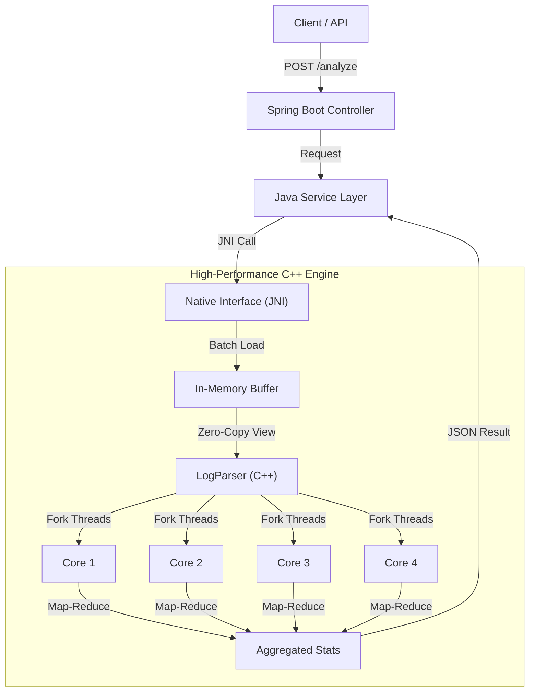

# 🚀 High-Performance Hybrid Log Analytics Engine

   

A high-throughput log processing system that leverages a hybrid **Java + C++ architecture** to overcome the performance limitations of standard string manipulation in managed languages.

By offloading compute-intensive parsing to a native C++ engine via **JNI (Java Native Interface)** and utilizing **OpenMP** for parallel execution, this engine achieves a **6x performance speedup** compared to standard serial processing when analyzing gigabyte-scale datasets.

-----

## ⚡ Performance Benchmarks

**Test Scenario:** 1GB Server Log File (\~10 Million Lines)
**Hardware:** Standard Multi-Core Laptop

| Method | Execution Time | Throughput | Relative Speed |
| :--- | :--- | :--- | :--- |
| **Serial Processing (Baseline)** | \~3,800 ms | \~260 MB/s | 1x |
| **OpenMP Parallel (Multi-Thread)** | **\~600 ms** | **\~1.7 GB/s** | **6.3x Faster** 🚀 |

*(Benchmarks include disk I/O overhead)*

-----

## 🏗️ System Architecture

The system uses a layered architecture to combine the ease of Spring Boot with the raw power of C++.



### Key Technical Features

  * **Hybrid Architecture:** Java handles HTTP/Orchestration; C++ handles the "Heavy Lifting."
  * **In-Memory Batch Processing:** Reads large files into a contiguous memory buffer in a single I/O operation to saturate disk bandwidth.
  * **Zero-Copy Parsing:** Uses C++17 `std::string_view` to parse millions of lines without expensive memory allocations (avoids Java String overhead).
  * **Parallel Map-Reduce:** Implements **OpenMP** to partition the memory buffer, process chunks in parallel on separate CPU cores, and reduce results thread-safely.

-----

## 🛠️ Getting Started

### Prerequisites

  * **Java 17+** (JDK)
  * **G++ Compiler** (MinGW for Windows, GCC for Linux/Mac) with **OpenMP** support.
  * **Maven** or **Gradle**

### 1\. Compile the C++ Engine

The C++ code must be compiled into a Shared Library (`.dll` or `.so`).

**Windows (MinGW):**

```powershell
g++ -shared -fopenmp -o loganalyzer.dll -I"%JAVA_HOME%\include" -I"%JAVA_HOME%\include\win32" cpp/log_analyzer.cpp cpp/LogParser.cpp
```

**Linux/Mac:**

```bash
g++ -shared -fopenmp -fPIC -o loganalyzer.so -I"$JAVA_HOME/include" -I"$JAVA_HOME/include/linux" cpp/log_analyzer.cpp cpp/LogParser.cpp
```

### 2\. Generate Test Data

Use the included Python script to generate a massive 1GB log file for stress testing.

```bash
python generate_logs.py
```

### 3\. Run the Application

Ensure the compiled library (`loganalyzer.dll`) is in the project root.

```bash
# Run with library path set to current directory
java -Djava.library.path=. -jar target/log-analyzer-0.0.1.jar
```

-----

## 🔌 API Usage

**Endpoint:** `POST /api/logs/analyze`

**Parameters:**

  * `path`: Absolute path to the log file.

**Request:**

```http
POST http://localhost:8080/api/logs/analyze?path=
```

**Response:**

```json
{
    "report": "=== HPC LOG ANALYTICS BENCHMARK ===\n[1] Serial: 3800ms\n[2] OpenMP: 600ms\n🚀 SPEEDUP: 6.3x FASTER"
}
```

-----

## 🧠 Deep Dive: Engineering Decisions

### 1\. Why `std::string_view`?

Standard string splitting creates new objects for every line, causing massive Heap allocation and Garbage Collection (GC) pauses.
By using `std::string_view`, we create lightweight "windows" into the raw memory buffer. This approach is **Zero-Alloc**, meaning the parser runs as fast as the CPU can read L2 cache.

### 2\. Solving the "Boundary Alignment" Problem

When splitting a 1GB file into chunks for parallel processing, a chunk might end in the middle of a log line.

  * **Naive Approach:** Threads break lines, causing data corruption.
  * **Our Solution:** The algorithm intelligently scans for the next newline (`\n`) character at chunk boundaries, ensuring every thread processes complete log lines without overlap or gaps.

-----

### 🔮 Future Improvements

  * [ ] **Memory Mapping (mmap):** Implement OS-level memory mapping to handle files larger than physical RAM.
  * [ ] **SIMD (AVX2):** Implement vectorized instructions to search for substrings 32-bytes at a time.
  * [ ] **Dashboard:** Add a frontend to visualize error rates over time.

